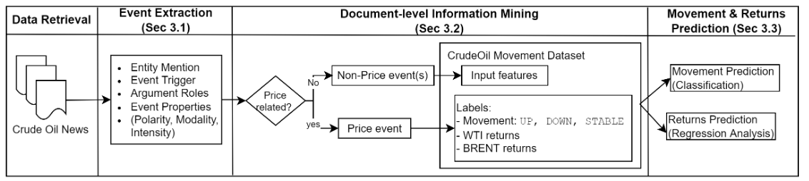
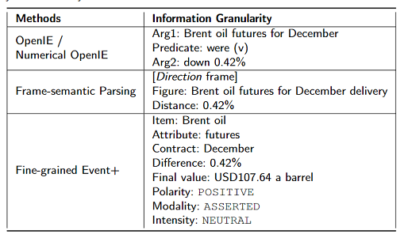

# Text Analytics for Crude Oil Market Summaries

## Introduction
This repository contains a sample dataset and PyTorch code for the paper entitled **"Crude Oil Price Movement and Return Prediction via Text Analytics on Market Summaries"** (to be submitted to Energy Economics Journal).

### Workflow


With reference to the workflow diagram above, this repository provides the codes for **Document_Level Information Mining** and **Crude Oil Movement and Returns Prediction**. To ensure the codes execute as per intended, please maintained the folder structure similar to this repository.

### 1. Document-Level Information Mining
Run _document_mining.py_ to use and restructure the extracted events into the input file for the next step: movement and returns prediction. \
Input: raw_data folder 
Output: dataset folder
```python document_mining.py ``` 


### 2. Crude Oil Movement and Returns Prediction
#### Model Architecture:
1. Price movement prediction: UP, DOWN, NO_CHANGE(FLAT) as multiclass classification. \
We propose a vanilla BERT-based **BERTForSequenceClassification** head for this classification task. The extracted span vectors are fed into the model; BERT's **BERTForSequenceClassification** head is equipped with a \textit{sigmoid} activation function to predict one of the three classes: UP, DOWN, FLAT.

2. Return prediction (percentage of price change) as regression analysis. \
we use the BERT-based model with **BERTForSequenceClassification** head for the regression task by setting the num_class = 1. The model predicts a single scalar value as output. We use two common losses for price prediction: root mean squared error (RMSE) and mean absolute percentage error (MAPE).

### Requirements


## Comparison with other Event-based Text Processing Approaches


1. Coarse-grained events:
   - OpenIE: https://github.com/allenai/allennlp
   - Numerical OpenIE: https://github.com/dair-iitd/OpenIE-standalone
2. Fine-grained events:
   - Frame-semantic parsing (SEMAFOR): https://github.com/swabhs/open-sesame
  
## Dataset
The dataset is made up of oil market summaries found on https://www.investing.com/commodities/crude-oil-news. It is a collection of news from a number of sources namely: from www.investing.com's own articles and from other sources such as www.Reuters,com and www.oilprice.com. Duration is from 2011 to 2019.

## Repository Contents
- ```dataset``` folder contains :
   - training data- ```train_data.json```
   - validation data- ```eval_data.json```
   - testing data- ```test_data.json```
- ```data``` folder contains (1) ```const.py``` file with Event Labels, Entity Labels, Argument Role Labels and other constants and 
- ```utils``` folder contains helper/utility functions:
   -   ```const.py``` file contains the labels for event properties (Polarity, Modality and Intensity) and as well as labels for price movement. 
   -   ```data_loader.py``` file contains functions relating to the loading of data.
   -   ```helper_functions.py``` file contains helper and utility functions needed for the training of the models.
- ```model``` folder contains the CommodityPricePrediction model ```CommodityPricePrediction.py```
- ```runs``` folder contains the output of the executions, this includes training and evaluation losses, F1 & MCC scores for price movement prediction and RMSE & MAPE calculations for price returns prediction.

## Experiments:
1. News input scope: News Headlines only, news body only and entire article
   Parameter: _header, body, all_
3. Ablation study: 
   - Event Trigger + Arguments + Properties  (parameter: _all_)
   - Event Trigger + Arguments - Properties (parameter: _minus_properties_)
   - Event Trigger - Arguments + Properties (parameter: _minus_arguments_)
   - Event Trigger - Arguments - Properties (parameter: _minus_arguments_properties_)


